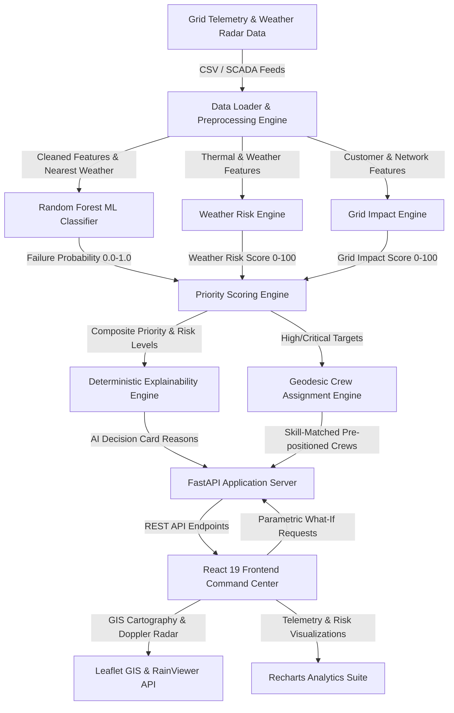

# Architecture

## System Architecture

The following diagram illustrates the complete end-to-end architecture of GridGuard AI, depicting the flow from raw data ingestion to interactive geospatial command center dispatch:

## Components

| Component | Technology | Responsibility |
|---|---|---|
| **Frontend Command Center** | React 19, TypeScript, Vite, Vanilla CSS | 7-page dark cyber command dashboard, executive KPI cards, action queue, alert center, and what-if simulation UI. |
| **Geospatial GIS Engine** | Leaflet, React-Leaflet, Esri Satellite, RainViewer API | Real-time cartographic rendering (street, satellite, dark ops), live precipitation Doppler radar overlay, and animated crew dispatch routes. |
| **Backend REST API** | FastAPI, Uvicorn, Pydantic | High-performance asynchronous API serving summary KPIs, predictions, equipment specs, crew fleet status, and what-if calculations. |
| **ML Predictive Core** | scikit-learn (`RandomForestClassifier`), joblib | Ingests 21 engineered feature vectors and outputs calibrated 7-day failure probabilities with balanced class weighting. |
| **Risk & Impact Engines** | Python 3, NumPy, pandas | Computes multi-signal Weather Risk (0–100) and Grid Consequence Impact (0–100) based on domain formulas. |
| **Explainability Engine** | Python 3 | Evaluates 16 deterministic engineering threshold rules per equipment asset to eliminate AI hallucinations. |
| **Dispatch Optimizer** | Python 3, `geopy` (Haversine math) | Geodesic spatial distance matching, trade certification compatibility filtering, and nearest crew allocation. |
| **AI Software Partner** | IBM Bob | Architecture scaffolding, vector math optimization, testing suites, and code quality enforcement across the SDLC. |

## Data Flow

1. **Ingestion**: Raw equipment metrics, weather station records, incident histories, and field crew rosters are loaded from CSV/SCADA sources.
2. **Preprocessing**: Missing numerical values are imputed via median strategy; equipment GPS coordinates are mapped to nearest weather station observations using geodesic Haversine distance; 21 features (`temp_stress`, `incident_rate`, `network_importance`) are engineered.
3. **Model Inference**: The trained Random Forest classifier evaluates the feature matrix to output failure probabilities.
4. **Multi-Signal Risk Scoring**: Weather risk and grid impact scores are computed concurrently; the composite priority score ($0.50 \times \text{failure} + 0.20 \times \text{weather} + 0.30 \times \text{impact}$) categorizes each asset into `CRITICAL`, `HIGH`, `MEDIUM`, or `LOW`.
5. **Auditable Explanation**: 16 rule thresholds are checked against each asset's telemetry; triggered reasons populate the AI Decision Card.
6. **Pre-Positioning Dispatch**: Eligible field crews (available, matching trade certification, positive capacity) are filtered and ranked by Haversine distance; the nearest crew is pre-positioned.
7. **REST Delivery**: FastAPI serializes all computed telemetry, predictions, explainability reasons, and crew assignments into JSON endpoints (`/api/summary`, `/api/predictions`, `/api/crews`).
8. **Reactive Dashboard Presentation**: React 19 visualizes the network on interactive Leaflet GIS maps, updates risk matrices, and enables real-time parametric scenario simulations.

## Security Considerations

- **Zero Hardcoded Secrets**: Sensitive API keys and operational environment configurations are stored strictly in `.env` (referenced via `.env.example`) and git-ignored.
- **Input Sanitization & Type Safety**: Pydantic models validate and sanitize all REST request bodies and custom CSV upload schemas, preventing injection and malformed payloads.
- **Offline & Isolated Execution**: The application runs completely offline on standard local network ports (5173 and 8000), preventing exposure of grid telemetry to public networks.

## Scalability Notes

- **Stateless Backend API**: The FastAPI service is fully stateless and can be horizontally scaled across multiple instances behind an enterprise load balancer (NGINX/Traefik).
- **Sub-2-Second Recalculation**: Vectorized NumPy and pandas operations allow recalculating priority scores and pre-positioning routes for thousands of assets in sub-second timeframes.
- **Streaming Pipeline Adaptability**: The modular pipeline architecture supports drop-in replacement of static CSV inputs with real-time Kafka or MQTT SCADA streaming telemetry in enterprise production environments.
