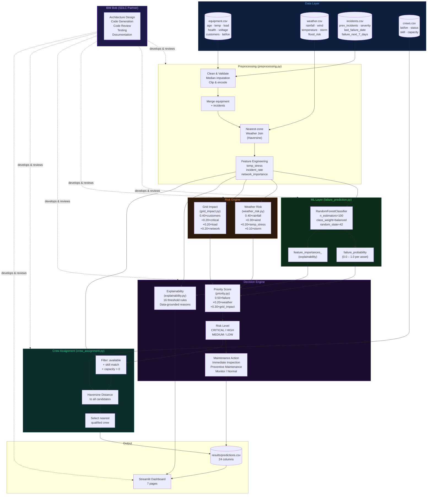

# Architecture

## System Architecture Diagram



---

## Module Responsibilities

| Module | File | Responsibility |
|---|---|---|
| Data Loader | `src/data_loader.py` | Load & validate 4 raw CSVs |
| Preprocessing | `src/preprocessing.py` | Clean, merge, weather join, feature engineering |
| Failure Prediction | `src/failure_prediction.py` | Train/load RF model, predict failure_probability |
| Weather Risk | `src/weather_risk.py` | 0–100 weather risk score |
| Grid Impact | `src/grid_impact.py` | 0–100 grid impact score |
| Priority | `src/priority.py` | 0–100 priority score, risk level, maintenance action |
| Explainability | `src/explainability.py` | Data-grounded risk explanations, feature importance |
| Crew Assignment | `src/crew_assignment.py` | Haversine + skill matching, nearest crew selection |
| Pipeline | `src/pipeline.py` | Orchestrate all modules, write predictions.csv |
| Dashboard | `src/dashboard/app.py` | Streamlit entry point, routing, caching |
| Settings | `src/config/settings.py` | Centralised path configuration |

---

## Data Flow

```
equipment.csv  ──┐
weather.csv    ──┤──> preprocessing.py ──> model_input.csv (26 cols)
incidents.csv  ──┘
                                        |
                              failure_prediction.py
                                        |
                              failure_probability
                                    /       \
                          weather_risk    grid_impact
                                    \       /
                                  priority_score
                                        |
                              risk_level + maintenance_action
                                        |
                              explainability (risk reasons)
                                        |
crews.csv ──────────────────> crew_assignment.py
                                        |
                              predictions.csv (24 cols)
                                        |
                              Streamlit Dashboard (7 pages)
```

---

## IBM Bob as SDLC Partner

IBM Bob is used **exclusively** as a development and SDLC assistant, not as a runtime API:

- Designed the module architecture and data flow
- Generated all Python source code (Phases 2–10)
- Ran smoke-tests and validated outputs after each phase
- Reviewed code for bugs, edge cases and error handling
- Wrote all documentation

The application's AI logic (failure prediction, risk scoring, explainability) runs entirely on scikit-learn and deterministic Python formulas — not on a language model at runtime.
